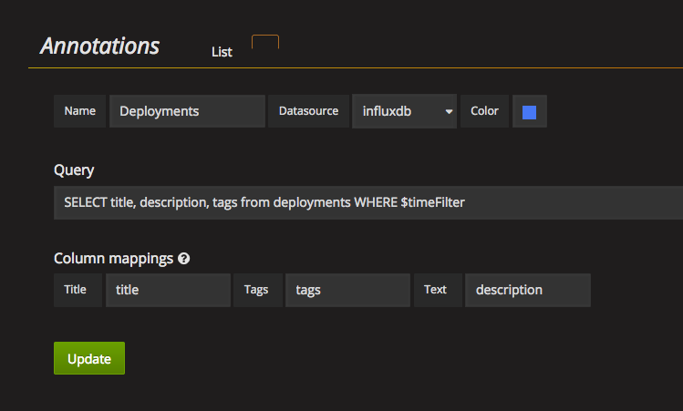

# Generate Grafana annotations type into InfluxDB for tracking events

In order to track events and been able to visualize them in [Grafana](http://docs.grafana.org/reference/annotations/), 
This script provides the functionality to create such events. 

## Requirements

- Influxdb Python -> https://github.com/influxdata/influxdb-python

## Usage

Secrets such as users and passwords are handled via environment variables for simplicity. 

Required ones are: 

```
INFLUX_URL = os.environ['INFLUX_URL']
INFLUX_USER = os.environ['INFLUX_USER']
INFLUX_PASSWORD = os.environ['INFLUX_PASSWORD']
INFLUX_DB = os.environ['INFLUX_DB']
```

You can simply execute it like:
```
$ INFLUX_URL=url INFLUX_USER=user INFLUX_PASSWORD=passwd INFLUX_DB=db python annotations.py
```

There is also help available:

```
$ python annotations.py -h
usage: annotations.py [-h] [--title TITLE] [--description DESCRIPTION]
                      [--tags TAGS]

Create annotations in InfluxDB to be displayed in Grafana

optional arguments:
  -h, --help            show this help message and exit
  --title TITLE         Title of the annotation
  --description DESCRIPTION
                        Brief description of the annotation
  --tags TAGS           Comma separated tags for the annotation

```

Example: 

```
python annotations.py --title myTitle --description myDescription --tags hello,world
```

This will generate the following:

```
[{
	'measurement': 'deployments',
	'time': '2017-05-22T11:25:05.597294',
	'fields': {
		'title': 'myTitle',
		'description': 'myDescription',
		'tags': 'hello,world'
	}
}]
```

## Grafana annotations

To add the annotations just copy the image values. The query is

```
SELECT title, description, tags from deployments WHERE $timeFilter
```




----------
Author: Pedro Diaz <pedro.diaz@tieto.com>